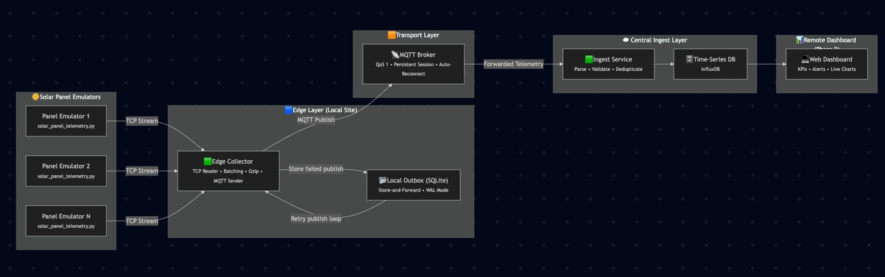

[](https://classroom.github.com/a/DbENLCjU)
[](https://classroom.github.com/online_ide?assignment_repo_id=21680952&assignment_repo_type=AssignmentRepo)
# Course Project — Foxhound Unit



Lightweight toolkit to generate per-panel solar telemetry, ingest it, and run basic validation/processing. This repository includes a telemetry generator, ingest utilities, a simple edge collector server and handlers, and a small set of tests.

Important: The repository is licensed under the PolyForm Noncommercial 1.0.0 license. Code and data are free for academic, research, and personal (noncommercial) use. Commercial/production usage requires a separate agreement.

---

## Contents

- `src/solar_panel_telemetry.py` — synthetic telemetry generator (CSV/JSONL). See the script docstring for usage examples.
- `src/edge_collector_server.py` — simple edge-level collector/server.
- `src/central_ingest.py` — ingest/process script (reads files or stdin depending on options).
- `src/records_handler.py` — utilities for handling and validating telemetry records.
- `src/ingest_fallback.jsonl` — sample fallback input for tests and ingest.
- `data/` — sample data & instructions.
- `tests/` — unit tests (pytest).
- `requirements.txt` — Python third-party dependencies.
- `LICENSE` — PolyForm Noncommercial 1.0.0.
- `THIRD_PARTY_NOTICES.md` — third-party notices and licenses.

---

## Requirements

- Python 3.8+ (recommended). See `requirements.txt` for third-party dependencies used in the project.
- If you use Conda: add an `environment.yml` and details in `requirements.txt`.

Typical dependencies (check `requirements.txt` for exact versions):
- pytest (for tests)
- Standard library modules for generator and ingest scripts.

---

## Installation

One recommended path (Windows example — cross-platform similar):

Option A — venv:
```powershell
cd c:\path\to\course-project-foxhound-unit-master
python -m venv .venv
.\.venv\Scripts\Activate.ps1   # PowerShell
python -m pip install --upgrade pip
pip install -r requirements.txt
```

Option B — conda:
```bash
conda env create -f environment.yml     # if environment.yml provided
conda activate your-env
pip install -r requirements.txt
```

Record environment for reproducibility:
```bash
python -V
pip freeze > reproducible-requirements.txt
```

---

## Usage

Each script has a `--help` option; consult it to view current flags. Example usage below is consistent with script docstrings but always verify `--help`.

### Generate telemetry (CSV / JSONL)
Example: generate CSV for 100 panels for 12 hours with a 60-second step:
```bash
python src/solar_panel_telemetry.py --panels 100 --start "2025-10-18T06:00:00" --hours 12 --step 60 --out telemetry.csv
```

Stream to stdout (CSV):
```bash
python src/solar_panel_telemetry.py --panels 10 --hours 1 --step 30
```

JSONL output:
```bash
python src/solar_panel_telemetry.py --format jsonl --panels 5 --minutes 30 --step 10
```

Deterministic runs:
- Add `--seed` to the generator for reproducible outputs.

### Run the edge collector and ingest
Start the edge collector (see `--help`):
```bash
python src/edge_collector_server.py
```

Run the central ingest script to process telemetry:
```bash
python src/central_ingest.py --help
python src/central_ingest.py --source telemetry.csv
```

Use the records handler to validate or transform data:
```bash
python src/records_handler.py --help
python src/records_handler.py --input telemetry.csv --action validate
```

---

## Reproducibility & Determinism

- Use `--seed` on the telemetry generator to produce deterministic telemetry sequences.
- To achieve identical thread scheduling or exact interleaving (e.g., for testing concurrency), additional synchronization changes are required in the code.
- Record seed and environment (`pip freeze`) when reproducing specific tests or outputs.

---

## Tests & CI

- Tests are in the `tests/` directory. Run them with:
```bash
pip install pytest
pytest
```

- Add tests when adding new functionality. Keep CI passing with lint/tests if you add a workflow.

---

## Data & Models

- Do not commit large or sensitive datasets.
- Use `data/` for small, allowed sample datasets.
- For large datasets, provide a download script and document the source and license.

---

## Secrets & Credentials

- Never commit secrets. Use `.env` files and git-ignored config, or CI secrets for automation.
- If your repo uses a `.env` or other local config, ensure it's included in `.gitignore`.

---

## Contributing

- Fork, create a branch, add tests and documentation, and submit a PR.
- Include details about changes and a minimal example to reproduce behavior.

---

## Roadmap & Limitations

- Roadmap ideas: add HTTP/gRPC streaming, Docker compose example, more robust validation and record schemas.
- Limitations: Simulated telemetry and small-scale ingest pipeline; not intended as a production-grade ingestion/storage system.

---


